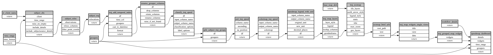

```
# AUTOGENERATED BY ECOSCOPE-WORKFLOWS; see fingerprint in README.md for details

```

```yaml
# fingerprint:
artifacts_sha256_basic: 21669554341da22abf9e30d5b55bd3e09ba06eecd96798bc28c3a9c1a67ae97f
artifacts_sha256_strict: ee9616026b600288d777028bc7a103407d1cb01f8586245feb1c299ea94153ec
installed_requirements:
- channel: https://repo.prefix.dev/ecoscope-workflows/
  name: ecoscope-workflows-core
  version: {version: ==0.22.18}
- channel: https://repo.prefix.dev/ecoscope-workflows/
  name: ecoscope-workflows-ext-ecoscope
  version: {version: ==0.22.18}
params_sha256: 918ac2ff7215793f4354c5a9e63e17a3acaebe62122b53e8e4339d05bba40ad6
spec_sha256: f82856da401e7dee976ee744485eb690a76c577222a9efd1dc178debe6ee7faf

```

# ecoscope-workflows-speedmap-workflow


